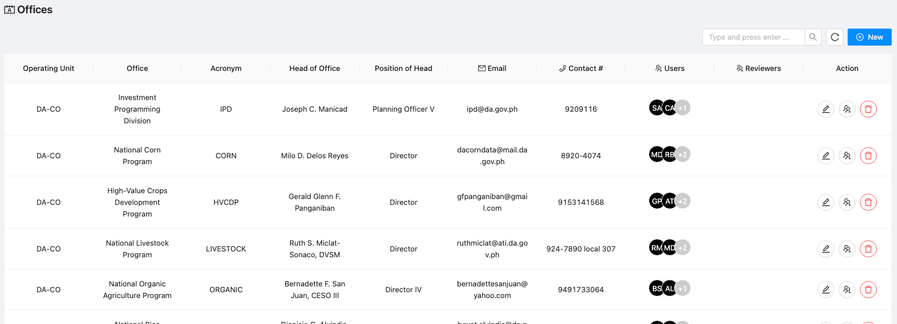
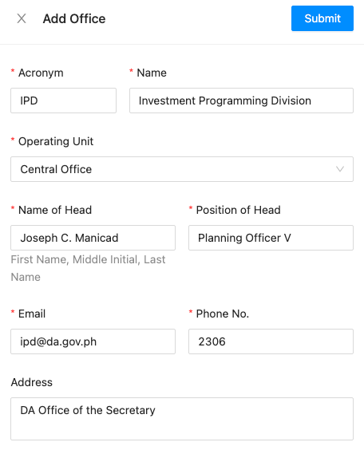
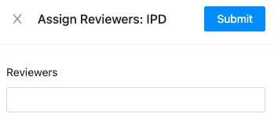
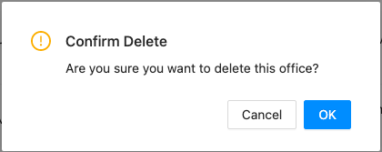

# Offices

:::warning
This is an admin only feature. If you wish to update information regarding your office profile,
please contact the IPD staff.
:::

## List of Offices

The list of offices is as shown below.

It shows information on the following:

  - Operating Unit - the operating unit as identified in the PREXC where the office belong to
  - Office - the full name of the office
  - Acronym - the recognized short name / acronym of the office
  - Head of office - the latest known head of office
  - Position of the head - the position/designation of the head of office
  - Email - the email address of the head of office
  - Contact # - the contact number of the head of office
  - Users - the users associated with the office which represent the PIP focal persons
  - Reviewers - the PIP reviewers assigned to review the office's PIP/TRIP/CIP submissions

## New and Edit Office

Creating a new and editing an existing office shares similar user interface and therefore, data requirements. See the list of
information above for description of each field. A data requirement not visible above is the address which is also set
as an optional field.

## Assign Reviewer(s)

To assign reviewer(s) to the office, click . A drawer with the following 
interface will appear. 

:one: Select the users from the list, as many as applicable, and 

:two: Click submit to assign them.

## Delete Office

To delete an office, click the . A confirmation dialog will appear. Click OK to proceed.

:::warning
This is a potentially destructive action as this would leave program investments and projects without office_id.
Proceed with caution.
:::
