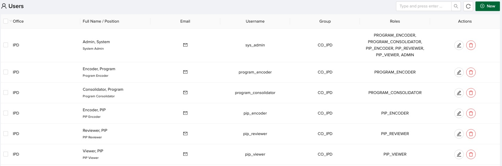
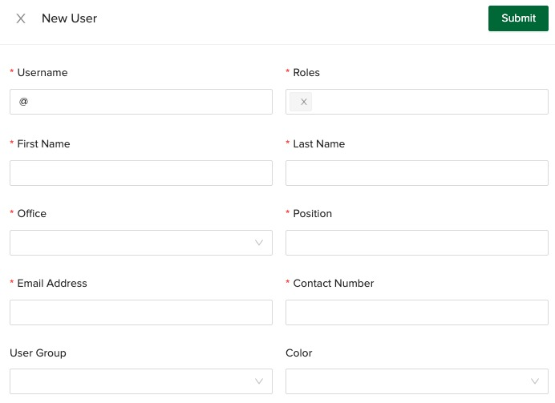
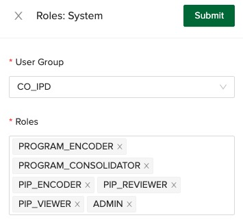

# Users

:::warning
This is an admin only feature. If you wish to update information regarding your profile that is NOT available
in the Update Profile feature, please contact the IPD staff.
:::

## User List

Admin accounts have access to the user list allowing them to create, update, and delete users. Below is a screenshot of the users page.

Above the table are the controls for: searching users, refreshing the table and creating new user. Below the table is the control for pagination.

The table has the following columns:

1. Checkbox for selecting user
2. Full name of the user and position
3. Email - the email of the user is obscured. Click on the email icon to view and/or copy the user's email
4. Group - the user group where the user belongs to
5. Roles - the roles the user are assigned to
6. Actions - edit and delete

## Create a New User

The admin can create a user by clicking on the new button, inputting the required information, and submitting it.

The fields are as follows:

1. Username - the username that the user will use in logging in to the system (must be unique, small caps, and users underscore as symbol only)
2. Roles - the roles the user are assigned to. Select as many as from the following:
    - PROGRAM_ENCODER
    - PROGRAM_CONSOLIDATOR
    - PIP_ENCODER
    - PIP_REVIEWER
    - PIP_VIEWER
    - ADMIN
3. First name
4. Last name
5. Office
6. Position
7. Email Address (must be unique)
8. Contact Number
9. User Group - the user group applies to the Consolidation module only by controlling what programs the user can contribute to.
As can be noticed from the selection, the pattern is CO\_{PROGRAM} and RFO\_{PROGRAM}. Aside from banner programs, GASS and STO
items are included too.
10. Color - color of the user avatar

:::success
After successfully creating the user, they will receive an email that contains their username and initial password. The password
is only known to the user through this mechanism. This is why it is important that the user provided a valid email and that they
have access to it.
:::

## Updating User Information

:::warning
Updating user information is available only to the user via the Manage Account feature.
:::

The admin can only update information on 1) User Group and 2) Roles.

To update user group and user roles, select user group from the dropdown and select multiple roles from the roles. Click submit.

:::warning
For the changes to be reflected on the user interface of the updated user, they just need to refresh the browser. If this does not work,
they may need to re-login.
:::
