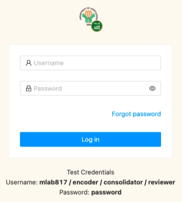

# Getting Started

1. To access the PIP System, open the web browser and type da-pips.com in the address bar.

2. The system will direct you to the Login Page.

3. The login page will appear as shown in the figure below. Enter your username and password
   as designated PIP Focal, and click the Login button.

__Note:__ After multiple failed attempts to log-in to the System, the user will be temporarily
locked out from logging in for security purposes. The user may use the "Forgot Password?" feature
to recover their password. An email will be sent to the email registered of the user with instructions
on how to reset their password.

4. Upon log-in, the user will be directed to the Dashboard. Posted in the Dashboard are
   information for the user’s reference such as the quick statistics and visualization of 
   the data inputted in the PIP System. __Note:__ Only data submitted in the Project module
   are reflected in the dashboard.

5. Select the operation to be performed by choosing among the modules in the Sidebar menu.
   The modules that can be accessed by the currently logged-in user vary depending on the type of the user (i.e.,
   Agency or DA-PIP/Focal) accessing the System.

