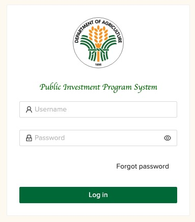

# Getting Started

## Account Registration

To become users of the PIP System, PIP focals of DA operating units must accomplish and submit
their PIP Authorization Form. The form must be duly signed by the head of agency as it is understood
that the PIP focal persons shall act on __behalf__ of their head of agency within the system.

You may download the PIP authorization form <a target="\_blank" href={require('./assets/confirmation_of_pip_focals.docx').default}>here</a>
and submit the accomplished form to [ipd@da.gov.ph](mailto:ipd@da.gov.ph).

## Accessing the System

1. To access the PIP System, open the web browser and type da-pips.com in the address bar. You may also copy the URL below and paste it to your browser.

```
https://da-pips.com
```

2. The system will direct you to the Login Page.

3. The login page will appear as shown in the figure below. Enter your username and password
   as designated PIP Focal, and click the Login button.



:::warning
After multiple failed attempts to log-in to the System, the user will be temporarily
locked out from logging in for security purposes. The user may use the "Forgot Password?" feature
to recover their password. An email will be sent to the email registered of the user with instructions
on how to reset their password.
:::

4. Upon log-in, the user will be directed to the Dashboard. Posted in the Dashboard are
   information for the user’s reference such as the quick statistics and visualization of 
   the data inputted in the PIP System. 

:::note
Only data submitted in the PIP/TRIP/CIP module
are reflected in the dashboard.
:::

6. Select the operation to be performed by choosing among the modules in the Sidebar menu.
   The modules that can be accessed by the currently logged-in user vary depending on the type of the user (i.e.,
   Agency or DA-PIP/Focal) accessing the System.

:::note
For replacement


:::

More detailed version:

|    Module     |  ADMIN  | PROG_ENCODER | PROG_CONSO | PIP_ENCODER | PIP_REVIEWER | PIP_VIEWER |
|:-------------:|:-------:|:------------:|:----------:|:-----------:|:------------:|:----------:|
|   Dashboard   | &#9745; |   &#9745;    |  &#9745;   |   &#9745;   |   &#9745;    |  &#9745;   |
| PIP/CIP/TRIP  | &#9745; |              |  &#9745;   |   &#9745;   |   &#9745;    |  &#9745;   |
| Consolidation | &#9745; |   &#9745;    |  &#9745;   |             |              |            |
| Activity Logs | &#9745; |   &#9745;    |  &#9745;   |   &#9745;   |   &#9745;    |  &#9745;   |
|    Account    | &#9745; |   &#9745;    |  &#9745;   |   &#9745;   |   &#9745;    |  &#9745;   |
|    Tracker    | &#9745; |              |            |             |   &#9745;    |            |
|     ADMIN     |         |              |            |             |              |            |
|    Offices    | &#9745; |              |            |             |              |            |  
|     Users     | &#9745; |              |            |             |              |            |
|  User Groups  | &#9745; |              |            |             |              |            |
|    Logout     | &#9745; |   &#9745;    |  &#9745;   |   &#9745;   |   &#9745;    |  &#9745;   |

:::info
Each user can have more than one role.
:::
