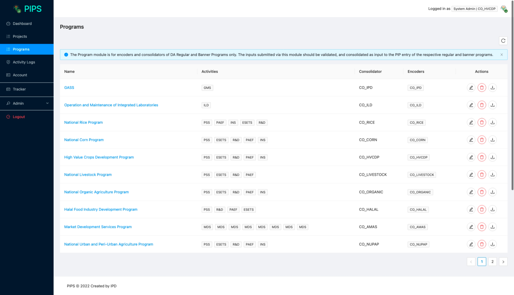
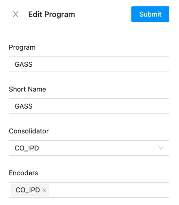

# Consolidation

The Program module provides a means for banner program consolidators to facilitate data submission from
the different implementing units of the program.

## List of Programs

The list of programs show the programs that the office of the user can contribute to or consolidate.

Below is a description of the columns in the table:

1. Name - the name of the program / banner program. Clicking on the name of the program
will show the summary of submissions.
2. Activities - the PREXC activities that the program / banner program consist of
3. Consolidator - the group of users assigned to consolidate the program
4. Encoders - the group of users assigned to encode their inputs for the program 
5. Actions - actions that users can do on each program.
   1. Edit Program - opens a popup [form](#edit-program) to edit the program
   2. Delete Program - 
   3. Download Program - 

## Edit Program

## User Group and Roles

