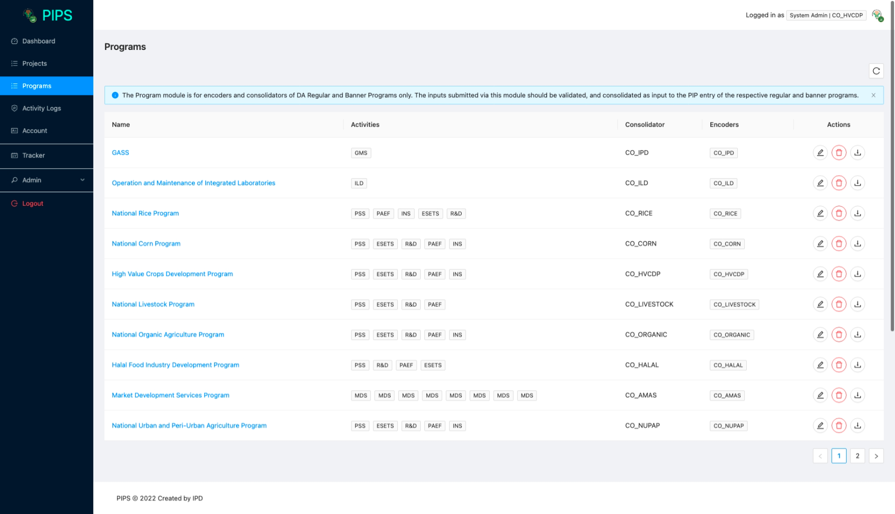
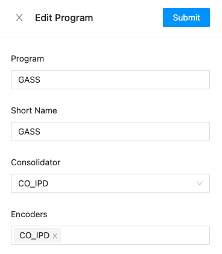

# Consolidation

The Consolidation module provides a means for banner program and other regular program consolidators to facilitate data submission from
the different implementing units of the program.

## List of Programs

The list of programs show the programs that the office of the user can contribute to or consolidate.

Below is a description of the columns in the table:

1. Name - the name of the program / banner program. Clicking on the name of the program
will show the summary of submissions.
2. Activities - the PREXC activities that the program / banner program consist of
3. Consolidator - the group of users assigned to consolidate the program
4. Encoders - the group of users assigned to encode their inputs for the program 
5. Actions  - actions that users can do on each program. 
   1. Edit Program - opens a popup [form](#edit-program) to edit the program
   2. Delete Program - opens a popup to confirm deletion.
   3. Download Program - downloads the investment targets per activitiy of each program.

## Edit Program

:::warning
Editing a program is only available to Admin users. If you wish to edit program, please contact IPD.
:::

## Delete Program

:::warning
Editing a program is only available to Admin users. If you wish to edit program, please contact IPD.
:::
