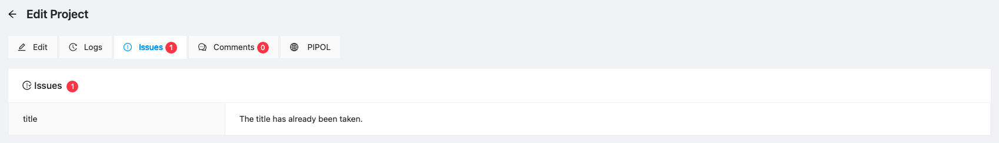

import Icon from '@material-ui/core/Icon'

# PIP/TRIP/CIP

The Project module is used to facilitate submission of programs and projects to PIP.

## List of PIP/TRIP/CIP

The list of programs and projects for inclusion to PIP, TRIP and CIP as shown in the table below.

:::note

The list of PAPs are shown based on the following rules:

| User Group                        | Rule                                                                     |
|:---------------------------------:|:-------------------------------------------------------------------------|
| IPD (CO_IPD)                      | All PAPs are shown                                                       |
| SPCMAD (CO_SPCMAD) & PDS (CO_PDS) | Only PROJECTS are shown                                                  |
| All Other User Groups             | Only PAPs belonging to the same office as the logged-in user are shown.  |
:::

__Project Menu__ contains controls for the project list. Each control is described as follows:

1. Search - allows users to search information present within the table's columns. This also searches
projects in the server.
2. Sort - predefined sets of keys that can be used to sort the table. Note: Sorting is done based on
id of the resource rather than the name / text.
3. Download - download list of projects with other data from the server
4. Refresh - reloads the table from the server
5. New - navigates to [new PAP page](#new-project)

Per Project menu:

1. Edit (  ) - Navigates to the [edit project page](#edit-project)
2. Delete (  ) - Allows user to delete PAPs
3. Lock / Unlock (  ) - Allows user to lock/unlock PAPs from further editing

## New PIP/TRIP/CIP

Form for adding a new project. See section on [data requirements](#data-requirements) for explanation and instructions.

> Note: Data fields with **(*)** are required.

### Data Requirements

#### General Information

1. Reflect the complete title of the program/project in the **Project Title** textbox. The
   project title to be reflected should be identical with the project’s title in the budget
   proposal to be submitted to DBM, if applicable.
    
   Note: The title is limited to 255 characters including spaces.

2. Select if the proposed entry is a __Project or a Program__. If Program is selected, indicate
if it is a **Regular Program** or not by clicking the Yes or No button. If the entry is a
project, reflect the complete title of the mother program of the project, if applicable,
in the Mother Program textbox.

Definitions

a. A **program** is a group of activities and projects that contribute to a common
particular outcome. A program should have the following: (a) unique expected
results or outcomes; (b) a clear target population or client group external to the
agency; (c) a defined method of intervention to achieve the desired result; and (d)
a clear management structure that defines accountabilities; and

b. A **project** is a special undertaking carried out within a definite timeframe and
intended to result in some pre-determined measure of goods and services.

3. Regular Program - A **regular program** refers to a program being implemented by agencies on a
   continuing basis. For regular programs, only the investment targets covering
   2023-2028 shall be submitted.

4. Basis for Implementation - Identify which of the following serve as the Basis for Implementation of the
   program/ project:
   - General Appropriations Act (GAA);
   - Multi-Year Obligational Authority (MYOA)/ Multi-Year Contracting Authority
   (MYCA);
   - Existing masterplan/Sector studies/procurement plan;
   - List of Regional Development Council-endorsed projects;
   - Signed Agreements (e.g. Peace agreements);
   - Existing laws, rules or regulations; or
   - Regular program.

5. Description - Identify the Components of the Program/Project in the Project Description text box
   provided. If a Program, please identify the sub-programs/projects and explain the
   objective of the program/project in terms of responding to the Philippine
   Development Plan (PDP) / Results Matrices (RM).

   If the PAP will involve construction of a government facility, specify the definite
   purpose for the facility to be constructed

6. Total Cost - The total cost of the program / project in absolute peso terms. For programs,
   report only the costs for years 2023-2028. For projects, report the total cost from the
   start of the project to its last year of implementation.

#### Spatial Coverage

7. Spatial Coverage - Select the Spatial Coverage of the program/project from the dropdown list, 
   which identifies the following options: Nationwide, Interregional, Region-Specific and
   Abroad. If the coverage is Interregional or Region-Specific, choose the region(s),
   province, and city/municipality covered by the program/project (if applicable) in the
   dropdown field.

   Please note of the following:
   - Nationwide refers to program/project with spatial coverage/impact covering ALL
   regions (in parts or as a whole);
   - Interregional refers to program/project with spatial coverage/impact covering
   more than one region (in parts or as a whole), but NOT ALL regions;
   - Region-Specific refers to program/project with spatial coverage/impact covering
   ONE REGION ONLY (in parts or as a whole); and
   - Abroad refers to program/project located or implemented outside the country that
   will benefit Filipinos (e.g. Overseas Filipino Workers).

:::note   
Agencies are required to identify the spatial coverage up to provincial level for
interregional and region-specific programs/projects.
:::
   
9. Regions / Provinces - Select the regions and provinces that the PAP covers in terms of impact. The region
will be automatically selected if all the provinces in the region are covered by the PAP.

#### Level of Approval

10. Level of Approval - If the project/program will require ICC/NEDA Board approval, kindly provide the
    status of ICC/NEDA Board processing of the program/project in the Level of
    Approval box, if applicable.
    - Yet to be submitted to the NEDA Secretariat. If this applies, provide the
    Target Date of Submission in the Date of Approval field.
    - Under the NEDA Secretariat Review. If this applies, provide the Date of
    Submission to NEDA Secretariat in the Date of Approval field.
    - ICC-TB Endorsed. If this applies, provide the Date of Approval in the 
      Date of Approval field.
    - ICC-CC Approved. If this applies, provide the Date of Approval in the Date of Approval
     field.
    - Is NEDA Board-Confirmed. If this applies, provide the Date of Confirmation
    in the Date of Approval field.

11. Date of Approval - see Level of Approval above

#### Project for Inclusion in Which Programming Document

Select under which Programming Document the program/project is being
submitted.

12. Public Investment Program - Tick the checkbox if the PAP is qualified for submission to PIP considering the 
criteria of responsiveness, readiness, and typology.

:::note
1. Responsiveness: (a) Responsive to the strategies and target outcomes/output in the Updated PDP 2017-2022 and 
its RM, and 0 to 10-Point Socioeconomic Agenda; AND (b) Included in ANY of the following: GAA, MultiYear Obligational Authority (MYOA)/ Multi-Year Contracting Authority (MYCA), Existing masterplan, sector 
studies, or procurement plan, List of Regional Development Council (RDC) - endorsed NG PAPs, Signed 
Agreements (e.g. Peace Agreements), Existing laws, rules or regulations, Regular program (e.g., Health Facilities 
Enhancement Program, Payapa at Masaganang Pamayanan Program, etc.); OR Addresses the impact and/or 
mitigate the loss due to the COVID-19 pandemic as identified in legislation and government reports.

2. Readiness: With level of readiness as follows:

For inputs:
| Level of Readiness    | CIPs / Non-CIPs                                                   | 
|-----------------------|-------------------------------------------------------------------|
| Level 1               | With approval of appropriate approving body but not yet ongoing
| Level 2               | With project preparation document** completed, for ICC processing in 2021, if for NG funding, included in the GAA for FY 2021 or for inclusion in FY 2022 budget proposal |
| Level 3               | With project preparation document completed, for approval of appropriate approving body in 2021, if for NG funding, included in the GAA for FY 2021 or for inclusion in FY 2022 budget proposal |

3. Typologies of PAPs that can be included in the Updated PIP: (a) Capital investment project to deliver public 
goods and services that contribute specifically to the country’s productive capacity (e.g. infrastructure development 
projects, delivery of social services); (b) Technical assistance PAPs such as research and development, institutional 
development, human resource capacity building or system/process improvements PAPs; (c) Relending PAPs to 
LGUs or other target beneficiaries; and (d) Government Facilities which are part of agencies’ development 
strategies and contributing to the outcome and output targets contained in the PDP. This does not cover government 
buildings that are purely for administrative purposes.
:::

4. Typology - Under the PIP, select under which Typology the program/project can be classified:
   - Capital Investment Program/Project;
   - Technical Assistance Program/Project (such as Research and Development,
   Institutional Development, Human Resource Capacity Building or System/Process
   Improvement PAPs);
   - Relending Program/Project to local government units (LGUs) or Other Target
   Beneficiaries; or
   - Government Facilities. PAPs for the construction of government facilities that
   are part of agencies’ development strategies and contributing to the outcome and
   output targets contained in the PDP. This does not cover government buildings that
   are purely for administrative purposes.

5. Three Year Rolling Infrastructure Program/Project

6. Core Investment Program/Project - If the program/project meets the criteria to be classified as CIP, please tick Core
   Investment Program/Project (CIP).

7. Type of CIP - Identify which CIP Typology the program/project can be classified:

   - Locally-funded major capital program/project with total project cost of at
   least PHP2.5 billion;
   - Official Development Assistance (ODA) grant - assisted program/project
   with total project cost of at least PHP2.5 billion;
   - ODA loan-assisted program/project regardless of amount that requires
   national government guarantee;
   - Relending program/project to LGUs and other target beneficiaries with total
   project cost of at least PHP 2.5 billion;
   - Solicited national Public-Private Partnership (PPP) projects;
   - Joint Venture (JV) program/project with government contribution of at least
   PHP 150 million

8. Gender & Development Responsiveness - Based on the score of the program/project using the Gender and Development (GAD)
   checklist, identify the Level of GAD Responsiveness of the program/project:
   - GAD is invisible;
   - Program/Project has promising GAD prospects;
   - Program/Project is gender-sensitive; or
   - Program/Project is gender-responsive.
   - Not Applicable

:::note
The GAD checklist can be accessed through the [link](https://www.neda.gov.ph/investment-coordination-committee/) under Forms
:::
9. Regional Development Investment Program/Project - Indicate if the Program/Project is included in the RDIP
   by ticking the checkbox.

10. If the PAP is included in the RDIP, tick the checkbox if it will require Regional Development Council (RDC)
    Endorsement?

11. RDC Endorsement Date - If the project requires RDC endorsement, provide Date of
    Endorsement in the date picker field.

12. Indicate if the Program/Project is a **Research and Development Program/Project**
    by ticking the checkbox.

13. Indicate if the Program/Project is an Infrastructure Flagship Project (IFP) by
    ticking the checkbox.

14. Indicate if the Program/Project is and ICT Program/Project by ticking the checkbox.

15. Is it responsive to COVID-19/New Normal Intervention? - Indicate if the PAP is a strategic response
    to the COVID-19 pandemic, or is a New Normal Intervention by clicking the Yes or No button.

16. COVID References - If the PAP is responsive to COVID-19/New Normal intervention, select
    among the following appropriate laws and/or guidelines which the program/project is
    aligned with:
    - Republic Act 11469 Bayanihan To Heal As One Act;
    - Republic Act 11494 Bayanihan to Recover As One Act
    - Socioeconomic Strategy Against COVID-19 Pillar I: Emergency support for vulnerable groups;
    - Socioeconomic Strategy Against COVID-19 Pillar II: Marshalling resources to fight COVID-19;
    - Socioeconomic Strategy Against COVID-19 Pillar III: Monetary actions and other financing support;
    - Socioeconomic Strategy Against COVID-19 Pillar IV: An economic recovery program to create jobs and sustain growth; and
    - We Recover as One report.

#### Philippine Development Plan (PDP) Chapter

17. Main PDP Midterm Update Chapter - Select from the dropdown list the Main PDP Midterm Update Chapter under which
    the program/project is expected to primarily contribute.

18. Other PDP Midterm Update Chapters - If the program/project cuts
    across sectors, Other PDP Midterm Update Chapters may be selected in the
    succeeding field in addition to the main PDP Chapter. User can select more than one
    (1) Other PDP Midterm Update Chapter, where applicable.

#### TRIP Requirements

19. Infrastructure Sector - Choose among the sector/s and corresponding subsector/s
    to which a PAP is classified. A combination of sectors/subsectors may be chosen
    should the program/project have different infrastructure components. The
    available choices are as illustrated below:
    
    
    

20. Status of Implementation Readiness - Choose which among the following
    requirements/indicators of readiness for the submitted program/project have
    already been complied with. A check mark indicates that a particular requirement
    has been complied with and that the same may be provided in the technical budget
    hearings (TBHs) or as may be requested by NEDA or DBM.
    - Pre-Feasibility Study/Business Case
    - Feasibility Study
    - Level of Approval
    - Right-of-Way Acquisition
    - Resettlement Action Plan
    - Environmental Compliance Certificate
    - RDC Endorsement
    - Detailed Engineering Design
    - Other Pre-Investment Activities
    - Not Applicable

21. Implementation Risks - The proponent should provide information on the potential or actual risks, if any, that may hinder the proposal

22. Mitigation Strategies - The proponent should also provide information on how the potential or actual risks can be mitigated.

#### Infrastructure Cost per Funding Source (in absolute PhP)

23. Funding Source - Select from the dropdown of funding sources. The following funding sources can be selected:

    - NG-Local
    - NG-ODA Loan
    - NG-ODA Grant
    - GOCC/GFI
    - Private Sector
    - Others - Other funding sources not classified under items a-f

24. Annual Infrastructure Cost - Input the target infrastructure cost per year in **absolute PhP terms**

:::note
A new row can be added by clicking the add button.
:::

#### Expected Outputs/Deliverables

26. Expected Outputs/Deliverables - Enumerate the Expected Outputs (or Actual Deliverables) of the program/project in
    the text box provided. Please provide specific outputs and units of measure (e.g., 100 km of FMRs, 1,000 seeds distributed, etc.).

#### Socioeconomic Agenda

27. Socioeconomic Agenda - Select which of the Socioeconomic Agenda the program/project is
    expected to address. User can select more than one (1) agendum, if applicable

#### Sustainable Development Goals (SDG)

28. Sustainable Development Goals - Select which of the Sustainable Development Goals (SDGs) the program/project is
    expected to contribute. User can select more than one (1) SDG, if applicable.

#### Project Preparation Details

30. Project Preparation Document - Identify the appropriate Project Preparation Document for the program/project from the following:
    - Feasibility Study (F/S);
    - Business Case;
    - Project Proposal;
    - Concept Note; and
    - Others.

32. Will require assistance for the conduct of F/S (from NEDA)?

33. Status of FS - Feasibility Study (F/S). Provide as well the Status of the Feasibility Study:
    - Completed;
    - Ongoing (specify the expected completion date); and
    - For Preparation (specify the target start date and if applicable, click the tick
        box to indicate that the program/project will require assistance for the
        conduct of Feasibility Study).

34. Total Cost of FS - Provide the total F/S cost in exact amount in PHP

#### Employment Generation

34. Employment Generated - Provide the estimated number of persons to be employed by the program/project in the
    text box field for Employment Generation. Indicate the number of persons to be
    employed by the project outside the implementing agency.

#### Funding Source and Mode of Implementation

35. Funding Sources - For the Main Funding Source, select all the applicable Funding Source options of
    the program/project from the list. If the program/project is for Official Development
    Assistance (ODA) loan or grant, consequent checkbox field will appear for the
    selection of the Development Partner concerned.

    - National Government (NG)-Local
    - NG-ODA Loan;
    - NG-ODA Grant;
    - GOCC/GFIs;
    - Private Sector; and/or
    - Others

36. ODA Funding Institution - Select the applicable ODA funding institution from the dropdown field.

37. Mode of Implementation/Procurement - Select the applicable mode of implementation or procurement from the following:

    - Republic Act (RA) No. 9184 or the Government Procurement Act;
    - RA 8182 or the ODA Act of 1996 (Through Development Partner’s
    Procurement Process);
    - Amended Build-Operate-Transfer Law and its Implementing Rules and
    Regulations;
    - Joint Venture Agreement; or
    - Others (Please input specific mode of implementation).

#### Physical and Financial Status

17. Project Status - For the Physical and Financial Status, indicate the Status of Project/Program
    as either Ongoing, Proposed or Completed, as applicable.
18. Category - Under Category, click whether the program/project is Tier 1 or Tier 2. If the
    program/project is categorized as Tier 1, provide the UACS Code in the text box field.
    For Tier 2 (New and Expanded), indicate whether the program/project is New or
    Expanded. Provide the UACS Code in the text box field for Expanded
    program/project
19. UACS Code - Provide the PAP Code which refers to the 15-digit code within the UACS Code
    that provides reference to the Sector/Horizontal Outcomes, Program/ Project, Major
    Final Output/ Project Category, Activity Level 1/Sub-Category and Activity Level 2
    / Project Title.
20. Start of Project Implementation - Provide the Implementation Period of the program/project by indicating the Start
    of Project Implementation in the year dropdown fields provided.
21. Year of Project Completion - Provide the Implementation Period of the program/project by indicating the Year of Project Completion in the year dropdown fields provided.
22. Level of Readiness - For the Physical and Financial Status, indicate the Status of Implementation
    Readiness as either Ongoing, Proposed or Completed, as applicable
23. Updates - Reflect detailed status of the program/project in the Physical and Financial Status
    Updates text box provided. For proposed program/project, please indicate the
    physical status of the program/project in terms of project preparation, approval,
    funding, etc. If ongoing or completed, please provide information on the delivery of
    outputs, percentage of completion and financial status/ accomplishment in terms of
    utilization rate.
24. As of (Updates) - Provide the reference date for the status provided in the As of date picker field

#### Investment Cost per Region (in absolute PhP)

47. Region - Select the region from the dropdown field.

48. Annual Investment Cost - Input the annual investment cost in absolute Php terms.

:::note
A new row can be added by clicking the add button.
:::

#### Investment Cost per Funding Source (in absolute PhP)

49. Funding Source - Select the funding source from the dropdown field.

50. Annual Investment Cost - Input the annual investment cost in absolute Php terms.

:::note
A new row can be added by clicking the add button.
:::

#### Financial Accomplishments (in absolute PhP)

For the table of financial accomplishments, provide the annual information on the
Amount Included in the National Expenditure Program (NEP), Amount
Allocated in the Budget/General Appropriations Act (GAA) and Actual Amount
Disbursed by the agency for the program/project. The value to be indicated should
be in exact amount in PHP. This field also has an auto-compute functionality.

51. National Expenditure Program (NEP)
52. General Appropriations Act (GAA)
53. Disbursement

> Note: The fields for in this table are disabled based on the projected availability of data. For example,
> it is expected that only the NEP and GAA figures will be available for the current year
> while the disbursement will only begin in the succeeding year.

## Edit Project

Same form with the new project but with the addition of submission status.

#### Submission Status

Submission Status - Select the applicable submission status as follows:

- Draft - Saves the changes while allowing continued editing the PAP
- Finalized - The PAP is submitted for review of the IPD
- Reviewed - The PAP has been reviewed by the IPD
- Validated - The PAP has been validated by the IPD lead/Chief
- Dropped - The PAP is labeled as dropped and will not be considered for submission to PIP/TRIP

## Logs

Shows the record of modifications done to the project including the
user that made the changes.

## Issues

System-identified issues on the project. Note, however, that some of these issues
need not necessarily be addressed.

## Comments

Allows reviewers to add comments to the project. Also allows user
to respond to the comments.

## PIPOL

For the use of PIP reviewers, for inputting of PIPOL entries to link the 
system submission to PIPOL System.

