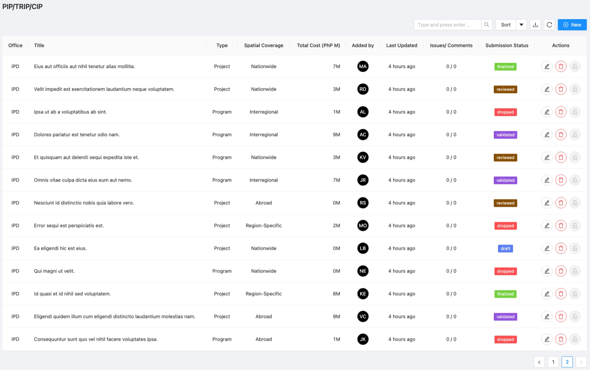
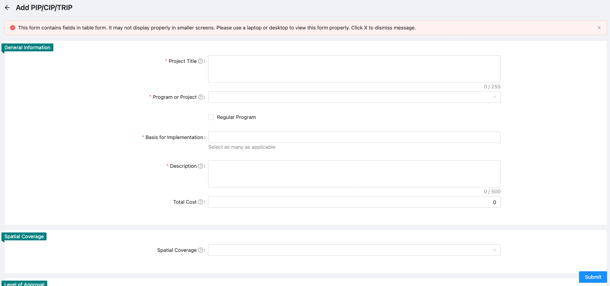
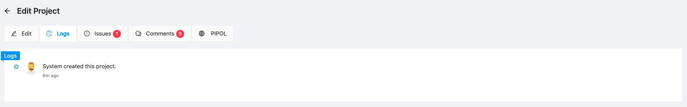
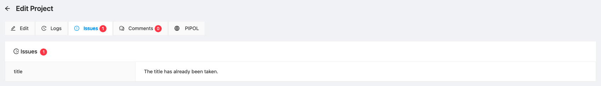
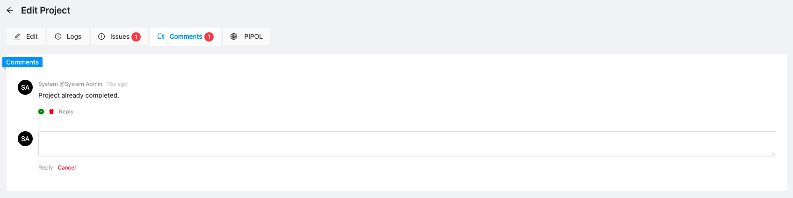
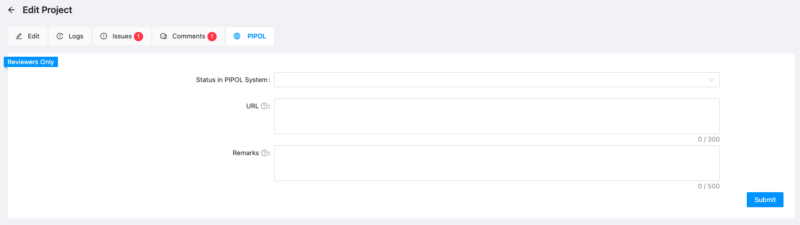

import Icon from '@material-ui/core/Icon'

# PIP/TRIP/CIP

The Project module is used to facilitate submission of programs and projects to PIP.

## List of PIP/TRIP/CIP

The list of programs and projects for inclusion to PIP, TRIP and CIP as shown in the table below.

:::note

The list of PAPs are shown based on the following rules:

| User Group                        | Rule                                                                     |
|:---------------------------------:|:-------------------------------------------------------------------------|
| IPD (CO_IPD)                      | All PAPs are shown                                                       |
| SPCMAD (CO_SPCMAD) & PDS (CO_PDS) | Only PROJECTS are shown                                                  |
| All Other User Groups             | Only PAPs belonging to the same office as the logged-in user are shown.  |
:::

__Project Menu__ contains controls for the project list. Each control is described as follows:

1. Search - allows users to search information present within the table's columns. This also searches
projects in the server.
2. Sort - predefined sets of keys that can be used to sort the table. Note: Sorting is done based on
id of the resource rather than the name / text.
3. Download - download list of projects with other data from the server
4. Refresh - reloads the table from the server
5. New - navigates to [new PAP page](#new-project)

Per Project menu:

1. Edit (  ) - Navigates to the [edit project page](#edit-project)
2. Delete (  ) - Allows user to delete PAPs
3. Lock / Unlock (  ) - Allows user to lock/unlock PAPs from further editing

## New PIP/TRIP/CIP

Form for adding a new project. See section on [data requirements](#data-requirements) for explanation and instructions.

> Note: Data fields with **(*)** are required.

## Edit Project

Same form with the new project but with the addition of submission status.

#### Submission Status

Submission Status - Select the applicable submission status as follows:

- Draft - Saves the changes while allowing continued editing the PAP
- Finalized - The PAP is submitted for review of the IPD
- Reviewed - The PAP has been reviewed by the IPD
- Validated - The PAP has been validated by the IPD lead/Chief
- Dropped - The PAP is labeled as dropped and will not be considered for submission to PIP/TRIP

## Logs

Shows the record of modifications done to the project including the
user that made the changes.

## Issues

System-identified issues on the project. Note, however, that some of these issues
need not necessarily be addressed.

## Comments

Allows reviewers to add comments to the project. Also allows user
to respond to the comments.

## PIPOL

For the use of PIP reviewers, for inputting of PIPOL entries to link the 
system submission to PIPOL System.

