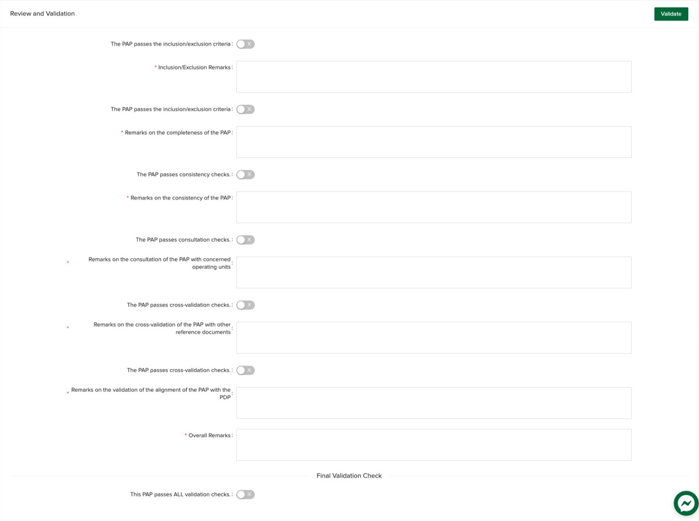

# Review and Validation

The IPD, as the DA PIP/TRIP Secretariat, conducts initial review and validation of the PAPs submitted in the PIPS in 
consultation with concerned operating units. The review and validation cover the following:

1. The PAP passes the inclusion/exclusion criteria as set by these and NEDA’s guidelines;

2. Completeness, i.e. whether all required data fields are filled up;

3. Consistency (consolidated figures vs. breakdown) of the data fields:

4. Consultation with other DA agencies that may have better technical capability to assess the PAP particularly national commodity and functional focals;

5. Cross-validation with other reference documents, e.g. NAFMIP, MYP, roadmaps, sectoral plans, budget documents (NEP, GAA, PBP), etc.; and

6. Alignment of the PAPs to the PDP Chapters and PDP RM indicators.

## Review and Validation Form

The review and validation form can be accessed in the edit PIP/TRIP/CIP page.

The IPD staff reviewing the PAP must tick the switch if the PAP passes the validation check required as well
as remarks to support the finding. Examples of validation remarks are as follows:

| Validation Check      |                   Remarks                                     |
|:---------------------:|:--------------------------------------------------------------|
|Inclusion/exclusion    | The PAP is under GASS.                                        |
|Completeness           | Regional breakdown is missing                                 |
|Consistency            | Total Cost report is not consistent with breakdown.           |
|Consultation           | Per Rice Program, the PAP is subsumed to the banner program.  |
|Cross-validation       | The PAP could not be found in any of the existing plans of DA.|
|PDP Alignment          | The PAP does not support any of the Results Matrix Indicators |
|Overall                | The PAP cannot be included in the PIP/TRIP as it does not pass all the validation checks |

At the bottom is the final validation check which will determine whether the PAP passes the overall validation
or not. If yes, the PAP will be marked as validated.

:::info
It is possible to mark the PAP as validated without passing all the checks. However, the form still requires
that all remarks are filled in case that the overall validation status needs to be reviewed.
:::
